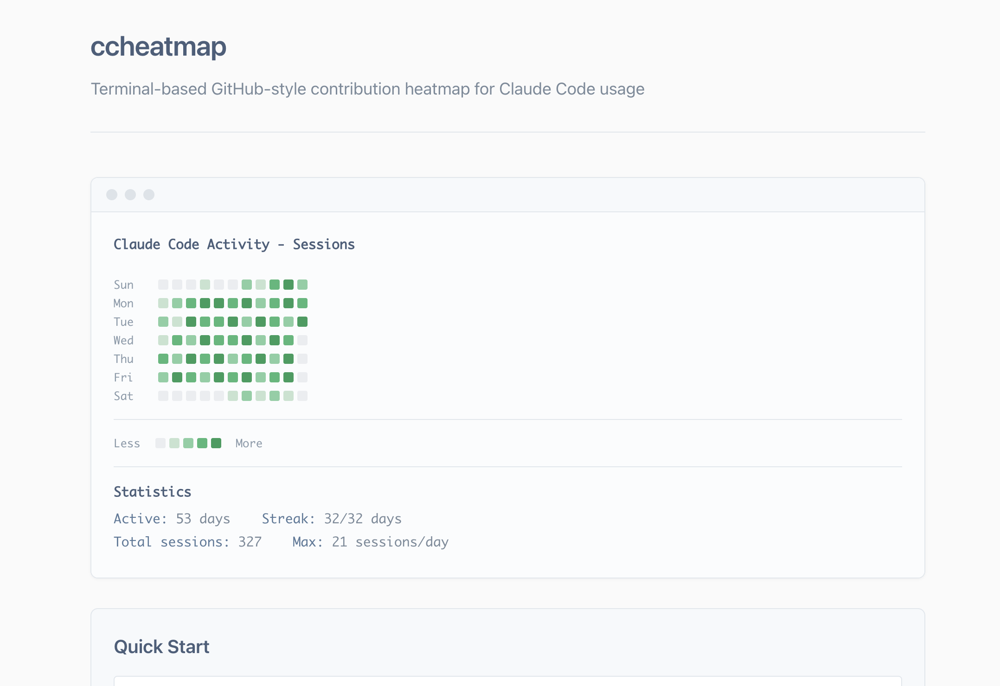

# ccheatmap

Terminal-based GitHub-style contribution heatmap for Claude Code usage.




## Quick Start

```bash
npx ccheatmap
```

## Demo

Watch it in action:

[](https://asciinema.org/a/8iFAvX66ihMEIIan4pa8ArwL1)

Or try it with sample data:

```bash
# Clone the repo
git clone https://github.com/viveknair/ccheatmap.git
cd ccheatmap

# Run the demo
npm install
npm run build
node demo/generate.js
```

## Usage

```bash
# Show last 2 months (default)
npx ccheatmap

# Show full year
npx ccheatmap --year

# Show different metrics
npx ccheatmap -m tokens
npx ccheatmap -m interactions

# Custom time range
npx ccheatmap -d 30

# Export as JSON
npx ccheatmap --json > data.json
```

## Options

- `-m, --metric <type>`: `sessions`, `tokens`, or `interactions` (default: `sessions`)
- `-d, --days <number>`: Number of days to show (default: `60`)
- `--year`: Show full year (365 days)
- `--no-legend`: Hide intensity legend
- `--no-stats`: Hide statistics
- `--no-months`: Hide month labels
- `--json`: Output raw data as JSON

## Requirements

- Node.js 18.0.0+
- Claude Code with usage history

## Data Location

Automatically finds Claude Code data in:
- `~/.config/claude/projects/`
- `~/.claude/projects/`
- Custom path via `CLAUDE_CONFIG_DIR`

## Author

Vivek Nair (vnair611@gmail.com)

## License

MIT